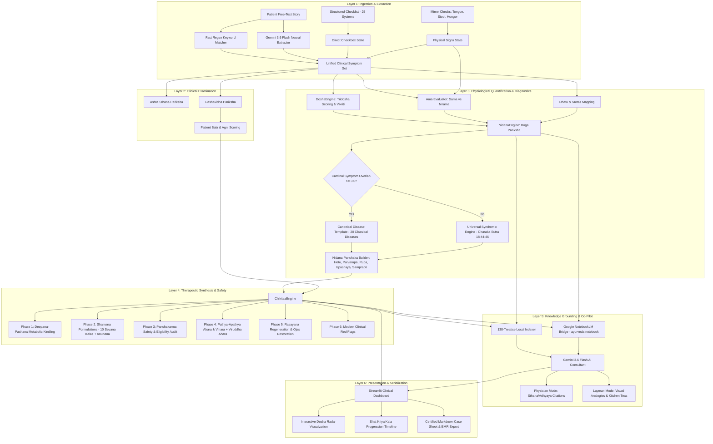

# AYURNIDANA: SYSTEM ARCHITECTURE & CLINICAL DESIGN SPECIFICATION

> **Classical Epistemology Grounded in Modern Software Engineering**  
> *A deterministic, multi-layered Ayurvedic diagnostic and therapeutic platform backed by 138 classical treatises, Rogi-Roga Pariksha, and AI clinical co-pilot integration.*

---

## 1. ARCHITECTURAL PHILOSOPHY & EXECUTIVE OVERVIEW

Modern AI medical diagnostic systems often suffer from two major flaws:
1. **Unconstrained Probabilistic Hallucination:** LLMs invent non-existent remedies, hallucinate drug dosages, or violate safety contraindications.
2. **Superficial Symptom Matching:** Keyword search systems ignore the fundamental Ayurvedic triad of **Dosha, Dhatu, and Srotas**, treating symptoms as isolated entities rather than systemic pathology (*Samprapti*).

**AyurNidana** solves this by enforcing a **deterministic axiomatic core**:
- **Diagnosis and Prescription** are governed by strict, unbending mathematical algorithms rooted in the *Brihat Trayi* (*Charaka Samhita*, *Sushruta Samhita*, *Ashtanga Hridaya*) and *Laghu Trayi* (*Madhava Nidana*, *Sharngadhara Samhita*, *Bhavaprakasha*).
- **Generative AI (Gemini 3.6 Flash)** is strictly sequestered as a **non-prescribing clinical co-pilot** used for natural language translation, patient-friendly explanations, and treatise synthesis. The AI is structurally prevented from overriding contraindications (e.g., *Ama-Shodhana* prohibition).
- **Knowledge Grounding** connects directly to the practitioner's library of **138 classical Sanskrit/Hindi treatises** on local disk and Google NotebookLM.

---

## 2. SYSTEM ARCHITECTURE & LAYER BREAKDOWN

---

## 3. DETAILED PROCESSING STEPS

### STEP 1: Dual Ingestion & Natural Language Normalization
1. **Patient Story Ingestion:** The patient describes symptoms colloquially in English, vernacular Hinglish, or Ayurvedic terminology (*"ghutno me dard"*, *"sour burps after oily meals"*, *"subah fingers stiff rehte hain"*).
2. **Dual Extraction Pipeline:**
   - **Deterministic Lexical Parser (`extract_symptoms_from_text`):** High-speed regex engine matching synonyms, anatomical stems, and classical terminology across 35 clinical categories.
   - **Generative Neural Extractor (`extract_symptoms_with_ai`):** Gemini 3.6 Flash extracts contextual clinical nuances into standardized string tokens (`joint_pain_cracking`, `acid_reflux_heartburn`, `tremors_stiffness`).
3. **Structured Checklist Ingestion:** 25 bodily systems divided into Annavaha (Gut), Asthi/Majja (Musculoskeletal), Pranavaha (Respiratory), Twak/Mutra (Skin/Urinary), and Manovaha (Mind).
4. **Auto-Unification Algorithm:**
   $$\mathcal{S}_{\text{Diagnostic}} = \mathcal{S}_{\text{Checklist}} \cup \mathcal{S}_{\text{Narrative}} \cup \mathcal{S}_{\text{Darshana (Mirror)}}$$
   Neither free text nor manual checklist items are discarded.

---

### STEP 2: Clinical Examination & Constitutional Assessment
1. **Ashta Sthana Pariksha (*Yogaratnakara*):**
   - **Nadi (Pulse):** Sarpa Gati (Vata), Manduka Gati (Pitta), Hamsa Gati (Kapha), or Dvandvaja combinations.
   - **Jihva (Tongue):** Coating (Ama marker), fissures (Vata), erythema (Pitta), pallor/swelling (Kapha).
   - **Mutra, Mala, Shabda, Sparsha, Druk, Akruti.**
2. **Dashavidha Pariksha (*Charaka Vimana 8*):**
   - **Constitutional Reserves:** Sara (Tissue excellence), Samhanana (Compactness), Sattva (Mental resilience), Ahara Shakti (Digestive capacity), Vyayama Shakti (Stamina), Vaya (Age stage).
   - **Bala Grading:** Computes patient constitutional strength:
     - **Pravara Bala (Superior):** Eligible for radical Shodhana.
     - **Madhyama Bala (Moderate):** Eligible for gentle Shodhana and Shamana.
     - **Avara / Hina Bala (Frail):** Radical elimination strictly prohibited.

---

### STEP 3: Physiological Quantification & Differential Diagnosis
1. **Tridosha Quantification (`DoshaEngine.calculate_vikriti`):**
   - Assigns weighted scores ($2.0 - 3.5$) per clinical marker.
   - Normalizes to exact percentages and classifies into:
     - **Single Dosha Pradhana** (Dominant Dosha $\ge 60\%$)
     - **Dvandvaja** (Dual Dosha gap $\le 15\%$)
     - **Sannipataja** (All three Doshas $\ge 25\%$)
2. **Metabolic State & Ama Assessment (`DoshaEngine.assess_ama`):**
   - Evaluates multi-system markers: tongue coating, post-prandial drowsiness, heaviness, sticky stools, loss of taste.
   - Categorizes into **Nirama** (clean), **Alpa-Ama** (mild), or **Sama** (acute endotoxic crisis).
3. **Dhatu & Srotas Mapping (`DoshaEngine.determine_dhatu_and_srotas`):**
   - Traces the seat of pathology across the 7 Dhatus and 13 Srotas systems.
4. **Cardinal Symptom Gating & Candidate Scoring (`NidanaEngine.diagnose`):**
   - Calculates overlap against canonical disease templates.
   - Requires primary cardinal symptoms to match, preventing false positives.
   - Applies penalties (e.g., Amavata penalized if Nirama; Sandhivata penalized if Sama).
5. **Universal Syndromic Fallback (*Charaka Sutrasthana 18:44-46*):**
   - If no canonical disease score exceeds threshold ($3.0$), the system dynamically synthesizes a complete classical syndromic diagnosis:
     $$\text{Syndromic Diagnosis} = f(\text{Aggravated Dosha}, \text{Vitiated Dhatu}, \text{Obstructed Srotas})$$
   - Formulates Sanskrit nomenclature (e.g., *Asthipradoshaja Vikara*, *Rasapradoshaja Vikara*).
6. **Nidana Panchaka Construction:**
   - Assembles the 5 diagnostic pillars: **Hetu** (etiology), **Purvarupa** (prodromes), **Rupa** (manifest symptoms), **Upashaya-Anupashaya** (differential trial), and **Samprapti** (6 stages of Shat Kriya Kala).

---

### STEP 4: Treatment Synthesis & Safety Guardrails (`ChikitsaEngine`)

The prescription is assembled across 6 systematic clinical phases:

| Phase | Clinical Objective | Classical Implementation | Safety Guardrails |
| :--- | :--- | :--- | :--- |
| **Phase 1: Deepana-Pachana** | Kindle Jatharagni & digest toxic Ama | Chitrakadi Vati, Trikatu, Shunthi Jala, Mudga Yusha | Mandatory before any heavy or nourishing herb is given |
| **Phase 2: Shamana** | Pacify aggravated Doshas in tissues | Classical Herbo-Mineral Formulations (Guggulu, Kwatha, Churna, Asava) | Strict matching of **10 Aushadha Sevana Kalas** and **Classical Anupana** vehicles |
| **Phase 3: Panchakarma** | Radical elimination of morbid humors | Vamana, Virechana, Basti, Nasya, Raktamokshana | **Strictly Contraindicated** if: (1) Patient has active Sama state (*Charaka Sutra 16*), (2) Age <12 or >75, (3) Avara/Hina Bala |
| **Phase 4: Pathya-Apathya** | Wholesome diet and lifestyle | Specific grains, pulses, vegetables, daily routines | Explicit **Viruddha Ahara** (incompatible food) warnings (milk + fish, heated honey, etc.) |
| **Phase 5: Rasayana** | Dhatu nourishment & relapse prevention | Amalaki Rasayana, Chyawanprasha, Ashwagandha, Brahmi | Prescribed only after Shamana clears toxins |
| **Phase 6: Red Flags** | Modern emergency medical safety | Cardiology, acute abdomen, stroke, hemorrhage flags | Clear warnings instructing emergency hospital referral |

---

### STEP 5: Knowledge Grounding & AI Co-Pilot

1. **Local Library Indexer (`LocalAyurvedaLibrary`):**
   - Scans 138 classical PDFs/EPUBs on disk (`OneDrive/Documents/ayurveda`).
   - Automatically indexes root Samhitas: Charaka, Sushruta, Ashtanga Hridaya, Madhava Nidana, Sharngadhara, Bhavaprakasha, Bhaishajya Ratnavali.
   - Maps active diagnosis to specific treatise files and chapters for clinical audit.
2. **Google NotebookLM Bridge (`NotebookBridge`):**
   - Connects to Google NotebookLM profile and targets the user's `ayurveda` notebook.
   - Allows querying distilled multi-document syntheses directly from authenticated CLI/session state.
3. **AI Consultant Co-Pilot (`AIConsultant`):**
   - Powered by **Gemini 3.6 Flash** (with fallback to `gemini-3.5-flash` and `gemini-flash-latest`).
   - Grounded with the patient's case sheet, local treatise excerpts, and classical principles.
   - Dual Persona:
     - **Physician Mode (Pranacharya / Vaidya):** Cites specific Sthana and Adhyaya, explains Shat Kriya Kala pathogenesis, and details Guna-Karma pharmacology.
     - **Layman Mode (AyurVaidya):** Uses vivid analogies (digestive fire, wind, water), focuses on kitchen remedies and lifestyle habits.

---

### STEP 6: UI Presentation & Clinical Export
1. **Interactive Dashboard:** Real-time Dosha radar chart, dynamic symptom attribution badges, Shat Kriya Kala 6-stage cards.
2. **Clinical Case Sheet (`generate_markdown_case_sheet`):** Formats complete patient record with Ashta Sthana, Dashavidha, Diagnosis, Prescription table, Panchakarma guidance, and follow-up timeline for EMR integration.

---

## 4. WHAT IS REQUIRED FOR THE FINAL PRODUCTION SYSTEM

To transition this system into a high-throughput, production-grade enterprise platform, the following architectural components are required:

### A. Infrastructure & Deployment Architecture
- **Containerization:** Docker container packaging Python 3.12, FastAPI backend, and React/Next.js or Streamlit frontend.
- **Microservices Topology:**
  - `Service-Nidana`: Deterministic algorithmic core (stateless, <5ms latency).
  - `Service-Knowledge`: Vector database (Qdrant / Milvus / pgvector) embedding the 138 classical treatises with hybrid sparse/dense search.
  - `Service-Gateway`: API gateway handling authentication (JWT), rate limiting, and audit logging.
  - `Service-Copilot`: Async worker interfacing with Gemini 3.6 Flash and Google NotebookLM.

### B. Classical Treatise Vector Indexing
- **Current State:** Filename and keyword regex indexing over the 138 treatises.
- **Production Requirement:**
  - Full-text extraction of all 138 Sanskrit/Hindi PDFs using OCR and layout analysis.
  - Granular chunking by Shloka, Sthana, and Adhyaya.
  - Semantic vector embeddings (`gemini-embedding-001` / `bge-large-en-v1.5`).
  - Strict citation provenance (retrieving the exact Sanskrit verse and English translation).

### C. Clinical & Regulatory Requirements
- **FHIR / HL7 Interoperability:** Mapping Ayurvedic diagnostic terms (NAMASTE portal and WHO International Terminology in Ayurveda) to standard FHIR resources.
- **Practitioner Override & E-Signatures:** System operates as Clinical Decision Support (CDS), requiring a certified Vaidya's electronic signature before formal dispensing.
- **Safety Audit Logging:** Immutably log all contraindication triggers (Ama detection, geriatric flags, drug interactions).

---

## 5. RECENT FIXES & REFACTORING LOG (Current Session)

1. **Layman AI Extractor Model Fix:**
   - Updated `extract_symptoms_with_ai` in [`layman_mapper.py`](file:///home/ashish/projects/ayurnidana/ayurnidana/core/layman_mapper.py) from deprecated `gemini-2.5-flash` to active `gemini-3.6-flash` with fallbacks.
2. **Sanskrit Typo Correction:**
   - Corrected typographical error in [`nidana_engine.py`](file:///home/ashish/projects/ayurnidana/ayurnidana/core/nidana_engine.py) line 133 from `"Medopr दोषी"` to `"Medopradoshaja (मेदःप्रदोषज)"` and added `Shukrapradoshaja`.
3. **UI Text Alignment:**
   - Synchronized UI banner, status ribbons, and spinner messages in [`app.py`](file:///home/ashish/projects/ayurnidana/ayurnidana/ui/app.py) to reflect `Gemini 3.6 Flash`.
4. **Dual-Input Auto-Unification:**
   - Enhanced symptom ingestion in [`app.py`](file:///home/ashish/projects/ayurnidana/ayurnidana/ui/app.py) so that written health descriptions and ticked checkboxes are automatically merged as a unified set with transparent attribution badges.
5. **Full Suite Verification:**
   - All **211 automated tests** passing with 100% green status across unit, integration, UI, scriptural authenticity, and NotebookLM alignment.
